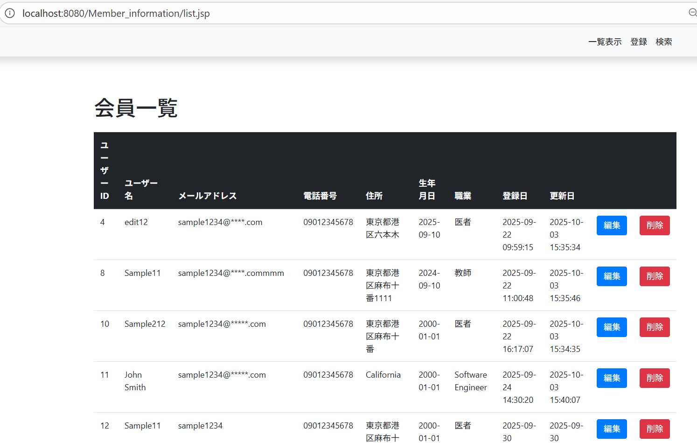
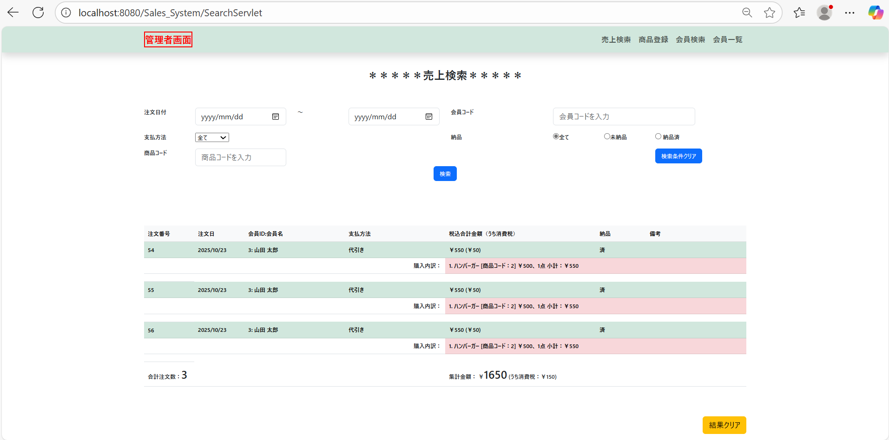
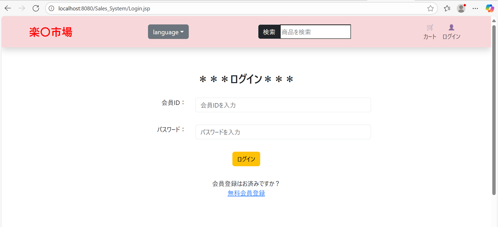
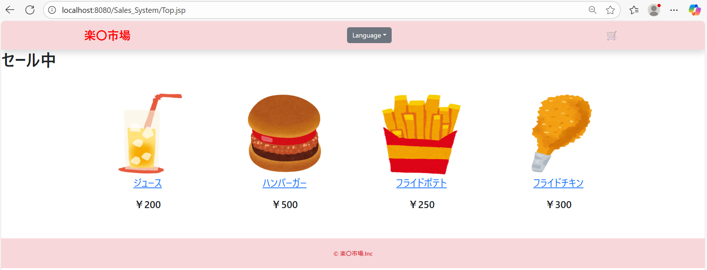

## 🔹 自己紹介
- ITエンジニア（1年）
- 得意分野: Webアプリ開発（バックエンド: Java / Servlet、フロント: HTML / Javascript / JSP）
- 業務経験: 結合テスト、システムテスト、詳細設計書作成など
 
---
 
## 🔹 技術スタック
### 言語
- C / Java / JavaScript / HTML / CSS / Go/ SQL
 
### フレームワーク
- Spring Framework
 
### DB・ミドルウェア
- SQL Server / PostgreSQL / MySQL / Oracle
 
### インフラ・ツール
- Docker 
- AWS
 
---
 
## 🔹 プロジェクト一覧
 
### 1. 会員情報管理システム（CRUD サンプル）
- **フォルダ:Member_information**
- **技術:** JSP (Frontend) + Java Servlet (Backend) + MySQL
- **ポイント:**
  - 会員マスタの登録・編集・削除・検索
- **スクリーンショット:**  
  
 
---
 
### 2. 売上情報検索システム
- **フォルダ:Sales_System**
- **技術:** JSP Javascrpit (Frontend) + Java Servlet (Backend) + + MySQL  
- **ポイント:**
  - 売上マスタの検索
- **スクリーンショット:**  
  - 売上検索画面
  
  - ログイン画面
  
  - 商品注文画面
  
---
 
## 🔹 今後取り組みたいこと  
- システム開発・アプリ開発（Java / C）  
 
---
