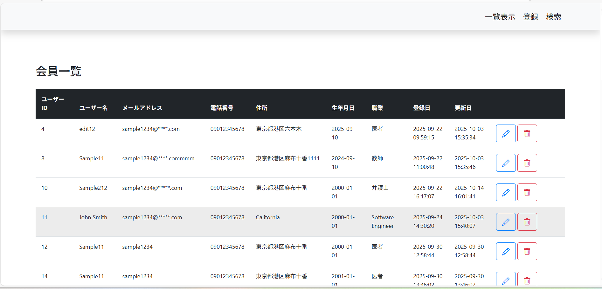
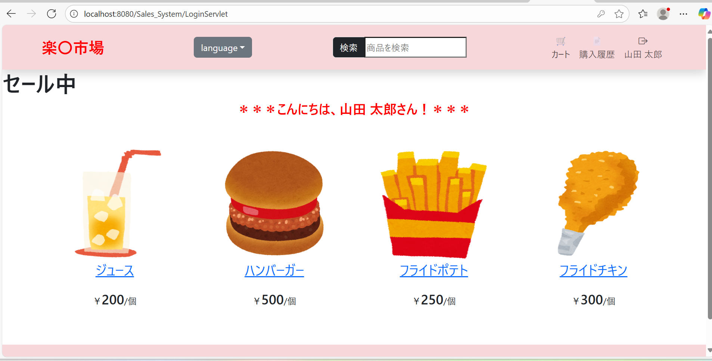

## 🔹 自己紹介
- ITエンジニア（1年）
- 得意分野: Webアプリ開発（バックエンド: Java / Servlet、フロント: HTML / Javascript / JSP）
- 業務経験: 詳細設計書作成、結合テスト、システムテストなど
 
---
 
## 🔹 技術スタック
### 言語
- C / Java / JavaScript / HTML / CSS / Go / Python / SQL
 
### フレームワーク
- Spring Framework
 
### DB・ミドルウェア
- SQL Server / PostgreSQL / MySQL / Oracle
 
### インフラ・ツール
- Git
- Docker 
- AWS
- JP1
- WinSCP
- Visual Studio Code
- Eclipse
 
---
 
## 🔹 プロジェクト一覧
 
### 1. 会員情報管理システム（CRUD サンプル）
- **フォルダ:Member_information**
- **技術:** JSP (Frontend) + Java Servlet (Backend) + MySQL
- **ポイント:**
  - 会員マスタの登録・編集・削除・検索
- **スクリーンショット:**  
  
 
---
 
### 2. 売上情報検索システム
- **フォルダ:Sales_System**
- **技術:** JSP Javascrpit (Frontend) + Java Servlet (Backend) + + MySQL  
- **ポイント:**
  - 売上マスタの検索
- **スクリーンショット:**  
  - <u>売上検索画面</u>：条件に一致する売上情報を検索表示する。
  
  
  - <u>商品登録画面</u>：商品をDB登録する。
  
  
  - <u>会員検索画面</u>：ユーザーIDとユーザー名をもとに会員検索する。
  
  
  - <u>会員一覧画面</u>：DB登録されている会員を全表示する。
  
  
  - <u>ログイン画面</u>：入力されたユーザーIDとパスワードのペアをDB検索し、一致するレコードがあればログインできる。
  会員登録画面に遷移することもできる。
  
  
  - <u>会員登録画面</u>：会員情報をDBに登録できる。
  
  
  - <u>TOP画面</u>：商品を表示する画面。ログインしなくてもアクセスできる。
  
  
  - <u>個数選択画面</u>：選択した商品の個数を調整できる。
  
  
  - <u>ショッピングカート画面</u>：カートに入れた商品が表示される。
  ゴミ箱アイコンを押下すれば、カートから削除可能。
  
  
  - <u>購入確定画面</u>：カートに入れた商品、小計、合計金額などを表示する。
  この画面で未ログイン状態であれば、会員登録を促す文言が表示される。
  
  
  - <u>購入履歴確認画面</u>：ログインユーザーの購入履歴が表示される。
  
  
---
 
## 🔹 今後取り組みたいこと  
- システム開発・アプリ開発（Java / Go）
- Webサイト開発（HTML / Javascript）
---
